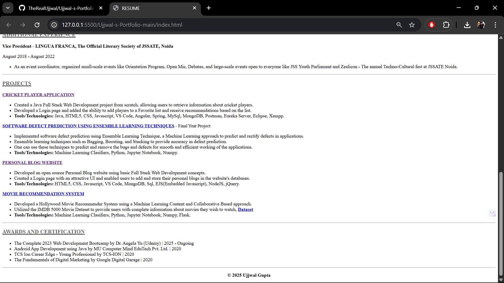

# Ujjwal-s-Portfolio

This is a simple, responsive **Resume Website** built using **HTML** and **CSS**.  
It highlights my education, skills, experience, projects, and achievements in a clean portfolio format.

---

## 🚀 Features
- Clean and professional single-page design
- Sections for Objective, Education, Technical Skills, Experience, Projects, and Certifications
- Clickable links for Portfolio, LinkedIn, GitHub, and LeetCode
- Minimal styling with external CSS for easy customization
- Mobile-friendly layout

---

## 🛠️ Technologies Used
- **HTML5**
- **CSS3**

---

## 📂 Project Structure
.
├── index.html # Main Resume page
├── CV.css # Stylesheet
└── README.md # Project documentation
└── LICENSE.md # License

---

## 📸 Preview

---

## 🌐 Live Demo
You can view the hosted version here:  
👉 [Resume Website on GitHub Pages](https://therealujjwal.github.io/Ujjwal-s-Portfolio/)

---

## 📄 License
This project is licensed under the **MIT License** – see the [LICENSE](./LICENSE) file for details.